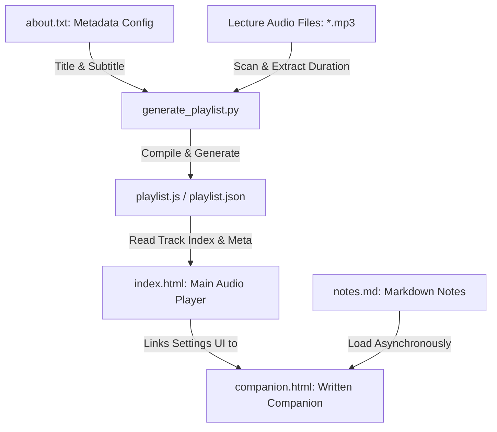

# Cybersecurity Concise Lecture Audio Player & Companion Suite

* **Live Player Website**: [https://shadowpbx.github.io/Cybersecurity_Concise/](https://shadowpbx.github.io/Cybersecurity_Concise/)
* **Audio Files Host**: [https://cybersecurity.epistemicresearch.org/concise/](https://cybersecurity.epistemicresearch.org/concise/)
* **Written Study Companion**: Access the `companion.html` page from the settings of the live player.


A premium, mobile-responsive, dark-themed HTML5 audio player designed for studying the Concise Cybersecurity Master Index. It supports custom track looping, speed controls, seek bar touch-scaling, and auto-resumes playback precisely where you left off.

---

## 🌟 Key Features

* 📱 **Mobile-First Responsive Design**: Beautiful glassmorphic dark-mode interface powered by system-sans typography and Material Round Icons.
* 🔁 **Custom Track Looping**: Set the player to repeat each lecture track multiple times (e.g., repeat 3 times) before automatically transitioning to the next track—ideal for reinforcement learning.
* ⚡ **Playback Speed Control**: Speed up or slow down lectures between `0.75x` and `2.0x` speeds.
* 💾 **Smart Auto-Resume**: The player automatically persists your track index, loop iterations, playback speed, timeline position, and base URL in your browser's local storage using namespaced keys (`cybersecurity_concise_*`) to avoid domain conflicts. If you refresh or reopen the page, it resumes exactly where you left off.
* 🔒 **Lock Screen Control Integration**: Fully utilizes the HTML5 browser **Media Session API** so you can play, pause, seek, and skip tracks directly from your phone's lock screen or notification panel.
* 📖 **Written Study Companion**: Access course study notes, definitions, theories, and summaries in a new browser tab (`companion.html`) directly from the player settings without interrupting audio playback.
* 📝 **Dynamic Metadata Integration**: Instantly changes the course Title and Subtitle dynamically on the page by parsing metadata.
* ☁️ **Cloudflare R2/S3 Ready**: Keep your repository lightweight! Host audio files in a public Cloudflare R2 bucket and configure the player to stream them directly.

---

## 🏗️ Project Architecture & Data Flow

This application is structured as a decoupled, client-side static web application designed to run locally (via the file system or a lightweight server). The interaction between elements is outlined below:



### 1. Main Audio Player (`index.html`)
The main application dashboard. It encapsulates the HTML5 audio engine and controls:
* **Audio Playback**: Custom speed selections, timeline scrubbing with touch-scaled seek targets, and lock-screen integration using the browser's `MediaSession` API.
* **Smart Looping Engine**: Allows looping each lecture track $N$ times before moving to the next track, with safety debounce guards to eliminate double-triggering events on mobile devices.
* **State Persistence**: Uses namespaced LocalStorage keys (`cybersecurity_concise_*`) to save your track index, playhead position, loop limits, and loop iterations.

### 2. Written Study Companion (`companion.html`)
The reading and reference dashboard:
* **Dynamic Markdown Rendering**: Uses the client-side `marked.js` library to asynchronously fetch and render the raw study guide (`notes.md`) directly into formatted HTML.
* **Multi-Theme Switcher**: Integrates four distinct reading themes (Dark Comfort, Warm Sepia, Light Paper, and Auto) configured with smooth color transitions and strict contrast rules.

### 3. Study Notes (`notes.md`)
The source file for all written study material (originally named `Cybersecurity Master Index concise.md`). Written in clean, portable GitHub-Flavored Markdown. Whenever you modify this file, the changes are automatically loaded and parsed by the companion page.

### 4. Playlist Compiler (`generate_playlist.py`)
A Python command-line utility that automates playlist compilation:
* Scans the project directory for `.mp3` tracks and sorts them naturally.
* Utilizes `ffprobe` (part of the FFmpeg toolkit) to query and extract the exact playtime duration of each track.
* Parses `about.txt` to load custom course titles.
* Outputs `playlist.json` and `playlist.js`.

---

## 📂 File Directory

* **`index.html`**: The core player application. 100% self-contained client-side code (HTML, CSS, JS).
* **`companion.html`**: The written study companion containing course notes, diagrams, and reference tutorials.
* **`notes.md`**: Markdown document containing your study notes.
* **`generate_playlist.py`**: A python script that scans your audio files and writes the catalog files.
* **`about.txt`**: A metadata text file containing the course Title and Subtitle. Used by the Python generator to dynamically brand the player.
* **`playlist.json` & `playlist.js`**: Automatically compiled playlist catalogs containing the track order and base URL configuration.

---

## 🚀 Setup & Usage Guide

### 1. Structure Your Audio Files
Upload your `.mp3` files to a hosting solution (e.g. Cloudflare R2 bucket) or keep them locally.

### 2. Configure Course Metadata
Edit the `about.txt` file in your root folder:
```txt
Title: Cybersecurity Concise
Sub Title: Cybersecurity Master Index Audio Study Suite
```

### 3. Generate the Playlists
The Python playlist compiler detects your audio files and creates catalog files for the player.

* Ensure you have `click` installed:
  ```bash
  pip install click
  ```
* Run the script to scan your local folders recursively and bind them to your Cloudflare R2 bucket base URL:
  ```bash
  python3 generate_playlist.py -d "." -b "https://cybersecurity.epistemicresearch.org/concise/"
  ```
The generator automatically parses your folder structure and writes out both `playlist.json` and `playlist.js`.

---

## 🛠 Local & Offline Development

This project is built to support offline learning:
* Open `index.html` directly in your browser (`file:///` protocol).
* To run the study companion notes locally without browser CORS blockages, run a local web server:
  ```bash
  python3 -m http.server 8000
  ```
  And navigate to `http://localhost:8000/companion.html` in your browser.
