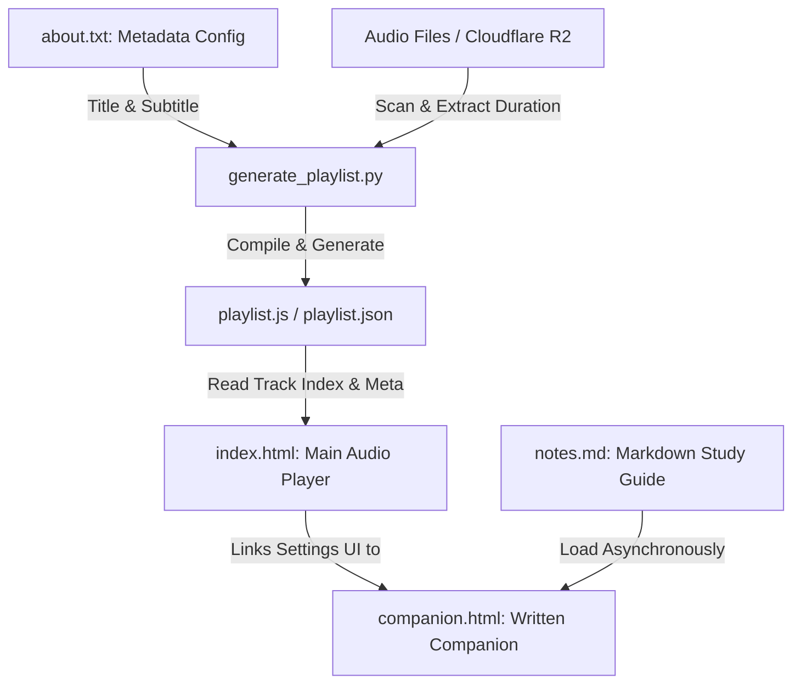

# Hacking Human Wetware Audio Player & Companion Suite

* **Live Player Website**: [https://hexdef.com/cybersecurity_audio/](https://hexdef.com/cybersecurity_audio/)
* **Written Study Companion**: Access the `companion.html` page from the player menu or directly at [https://hexdef.com/cybersecurity_audio/companion.html](https://hexdef.com/cybersecurity_audio/companion.html).

A premium, mobile-responsive, dark-themed HTML5 audio player and study companion suite exploring **50 Legendary Heists, Cons, and Exploits** across 5 structured categories—mapping each historical con directly to its modern cybersecurity and social engineering attack vector. Features custom track looping, exclusive category accordion grouping, continuous flat list toggle, dynamic viewport tracking for mobile/iOS, and auto-resuming playback.

---

## 🌟 Key Features

* 📱 **Mobile-First Responsive Design**: Glassmorphic dark-mode interface powered by system-sans typography (`Outfit`) and Material Round Icons.
* 🔁 **Custom Track Looping**: Repeat each lecture track multiple times (e.g., repeat 3 times) before automatically transitioning to the next track—ideal for reinforcement learning.
* 📚 **5 Historical Category Accordions**: Automatically categorizes all 50 case studies into 5 core psychological and operational categories with auto-collapsing accordions and playtime counters.
* 🔀 **[ 📁 Grouped | ☰ Flat ] View Toggle**: Switch seamlessly between category accordions and a continuous flat directory with automatic scroll-to-active tracking.
* 🔝 **Always-Visible Floating `[ ▲ Top ]` Button**: Floating screen button (`z-index: 9999`) for quick return to the top on any device.
* 💾 **Smart Auto-Resume**: Automatically persists your current track, loop iteration count, timeline position, and Cloudflare R2 base URL in browser LocalStorage.
* 🔒 **Lock Screen MediaSession Control**: Full integration with the HTML5 browser **Media Session API** to play, pause, seek, and skip tracks directly from phone lock screens or notification panels.
* 📖 **Written Study Companion**: Access full markdown study notes, psychological levers, and cyber mappings in a dedicated dashboard (`companion.html`) with multi-theme support (Dark Comfort, Warm Sepia, Light Paper, Auto).
* ☁️ **Cloudflare R2 / S3 Storage Integration**: Stream audio files directly from remote bucket storage (`https://your-bucket-domain.com/path/`) to keep the repository lightweight.

---

## 🏗️ Project Architecture & Data Flow



### 1. Main Audio Player (`index.html`)
The core audio dashboard encapsulating the HTML5 audio engine, category accordion rendering, search filter, and MediaSession lock screen integration.

### 2. Written Study Companion (`companion.html`)
The study reference dashboard utilizing `marked.js` to render `notes.md` into formatted HTML with theme switching.

### 3. Study Notes (`notes.md`)
The complete Markdown study guide covering all 5 Categories:
1. Authority, Impersonation & Credential Spoofing
2. Greed, Exclusivity & Advance-Fee Fraud
3. Social Proof, FOMO & Fabricated Reality
4. Sympathy, Trust, Fear & Relationship Exploitation
5. Diversion, Bypassing & Physical Pretexting

### 4. Playlist Compiler (`generate_playlist.py`)
A Python CLI utility that scans local folders or remote URLs, extracts track durations via `ffprobe`, parses `about.txt`, and generates `playlist.json` and `playlist.js`.

---

## 📂 File Directory

* **`index.html`**: Core audio player web app.
* **`companion.html`**: Written study companion rendering markdown notes.
* **`notes.md`**: Markdown study notes source file.
* **`about.txt`**: Course title and subtitle configuration file.
* **`generate_playlist.py`**: Python CLI playlist generator tool.
* **`playlist.json` & `playlist.js`**: Compiled playlist catalogs containing track metadata and base URLs.

---

## 🚀 Setup & Usage Guide

### 1. Configure Course Metadata (`about.txt`)
Set your course title and subtitle:
```txt
Title: Hacking Human Wetware
Sub Title: 50 Legendary Heists, Cons, and Exploits
```

### 2. Generate Playlist Catalogs
Run `generate_playlist.py` scanning the local `Audio` folder to bind them to your Cloudflare R2 base URL:

```bash
python3 generate_playlist.py -d "Audio" -b "https://your-bucket-domain.com/path/"
```

---

## 🛠 Local Development & Server Setup

Web browsers enforce CORS security restrictions that prevent fetching local `notes.md` and `playlist.json` when opening `.html` files directly via `file://`.

To run locally:
1. Start the local Python HTTP web server:
   ```bash
   python3 -m http.server 8000
   ```
2. Navigate to:
   * **Audio Player**: `http://localhost:8000/index.html`
   * **Study Companion**: `http://localhost:8000/companion.html`
