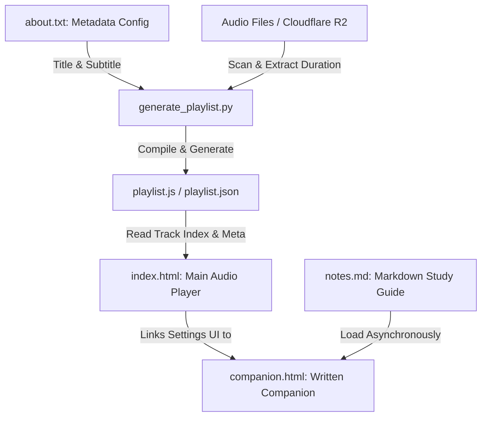

# Master Index of Algorithms Audio Player & Companion Suite

* **Live Player Website**: [https://engineering.hexdef.com/algorithms/](https://engineering.hexdef.com/algorithms/)
* **Written Study Companion**: Access the `companion.html` page from the player or directly at [https://engineering.hexdef.com/algorithms/companion.html](https://engineering.hexdef.com/algorithms/companion.html).

A premium, mobile-responsive, dark-themed HTML5 audio player and companion study suite designed for the **Master Index of Algorithms** curriculum. It features custom track looping, streamlined 5-speed control, domain objective chapter grouping, timeline scrubbing, and auto-resuming playback.

---

## 🌟 Key Features

* 📱 **Mobile-First Responsive Design**: Glassmorphic dark-mode interface powered by system-sans typography (`Outfit`) and Material Round Icons.
* 🎛️ **Symmetrical 5-Button Circular Transport Bar**: Clean, hardware-inspired 5-circle transport bar (`[ ⏱️ Speed ]` `[ |◀ Prev ]` `[ ▶ Play ]` `[ Next ▶| ]` `[ 🔁¹ Loop ]`) maximizing vertical screen space.
* 🔁 **Precision SVG Circular Track Looping**: Repeat each lecture track multiple times (`1` → `2` → `3` → `∞` → `1`) before automatically transitioning to the next track—ideal for reinforcement learning.
* ⚡ **Streamlined 5-Speed High-Impact Control**: Instant single-tap cycling through the 5 core study speeds (`1.0x` → `1.1x` → `1.2x` → `0.8x` → `0.9x` → `1.0x`) with double-click reset shortcut.
* 📚 **Domain Objective Chapter Grouping**: Automatically categorizes all 55 tracks into 11 core Algorithm domains with collapsible headers and total playtime counters.
* 💾 **Smart Auto-Resume & Namespace Isolation**: Automatically persists your current track, loop iteration count, playback speed, and timeline position with dynamic local storage isolation for multi-tab playback.
* 🔒 **Lock Screen MediaSession Control**: Full integration with the HTML5 browser **Media Session API** to play, pause, seek, and skip tracks directly from phone lock screens or notification panels.
* 📖 **Written Study Companion**: Access full markdown study notes and definitions in a dedicated dashboard (`companion.html`) with multi-theme support (Dark Comfort, Warm Sepia, Light Paper, Auto).
* ☁️ **Cloudflare R2 / S3 Storage Integration**: Stream audio files directly from a public Cloudflare R2 bucket (`https://engineering.hexdef.com/algorithms/`) to keep the repository lightweight.
* 🔄 **Re-usable Course Engine**: The entire suite is course-agnostic—update `about.txt` and `notes.md` to reuse the player for any other audio course.

---

## 🏗️ Project Architecture & Data Flow



### 1. Main Audio Player (`index.html`)
The core audio dashboard encapsulating the HTML5 audio engine, domain chapter accordion rendering, search filter, and MediaSession lock screen integration.

### 2. Written Study Companion (`companion.html`)
The study reference dashboard utilizing `marked.js` to render `notes.md` into formatted HTML with theme switching.

### 3. Study Notes (`notes.md`)
The complete Markdown study guide covering all 11 Algorithm Domains:
1. Sorting & Searching (The Foundations)
2. Graph & Network Algorithms (Routing & Relationships)
3. Dynamic Programming (Optimization & Memory)
4. String Processing, Parsing, & Compression (Text Processing)
5. Mathematics & Number Theory
6. Computational Geometry (Spatial & Visual)
7. Cryptography & Security
8. Big Data, Hashing, & Streaming (Scale)
9. Machine Learning, AI, & Meta-Heuristics
10. Distributed Systems & Consensus
11. Quantum Algorithms (The PhD Frontier)

### 4. Playlist Compiler (`generate_playlist.py`)
A Python CLI utility that scans local folders or remote URLs, extracts track durations via `ffprobe`, parses `about.txt`, and generates `playlist.json` and `playlist.js`.

---

## 📂 File Directory

* **`index.html`**: Core audio player web app.
* **`companion.html`**: Written study companion rendering markdown notes.
* **`notes.md`**: Markdown study notes source file.
* **`about.txt`**: Course title and subtitle configuration file.
* **`generate_playlist.py`**: Python CLI playlist generator tool.
* **`playlist.json` & `playlist.js`**: Compiled playlist catalogs containing track metadata and base URLs.

---

## 🚀 Setup & Usage Guide

### 1. Configure Course Metadata (`about.txt`)
Set your course title and subtitle:
```txt
Title: Master Index of Algorithms
Sub Title: The Definitive Computer Science Reference
```

### 2. Generate Playlist Catalogs
Run `generate_playlist.py` to scan your local audio files and bind them to your Cloudflare R2 base URL:

```bash
python3 generate_playlist.py -d "Audio" -b "https://engineering.hexdef.com/algorithms/"
```

---

## 🛠 Local Development & Server Setup

Web browsers enforce CORS security restrictions that prevent fetching local `notes.md` and `playlist.json` when opening `.html` files directly via `file://`.

To run locally:
1. Start the local Python HTTP web server:
   ```bash
   python3 -m http.server 8000
   ```
2. Navigate to:
   * **Main Audio Player**: [http://localhost:8000/index.html](http://localhost:8000/index.html)
   * **Written Companion**: [http://localhost:8000/companion.html](http://localhost:8000/companion.html)
